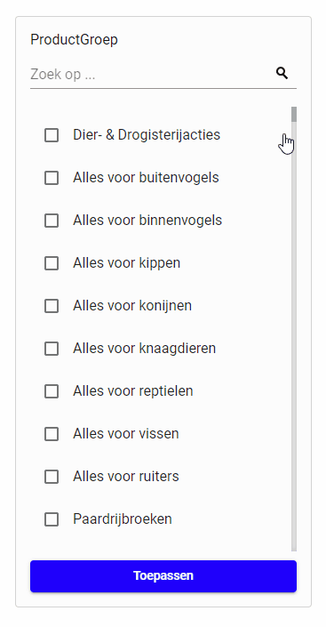

## Toelichting oplossing:
Deze opdracht is gemaakt in Angular 8, met behulp van [Material Design](https://material.angular.io/). Ik heb met het aangeleverde screenshot in het achterhoofd een vergelijkbare multiple-select-filter gemaakt. Hierbij heb ik in het achterhoofd gehouden dat het filter wellicht ook voor andere doeleinden zou kunnen dienen en heb daarom zaken als het opvragen van de data en het geven van de namen, buiten het component gelaten. Dit soort informatie dient ter input voor het component.
Het component zit in een eigen Module, waardoor het gemakkelijk is deze eventueel naar een aparte NPM library te extracten. 

Voor de tests heb ik de combinatie van Jasmine en Karma gebruikt. Hierbij heb ik voor de meest basale use cases tests geschreven, gebruikmakende van TDD. Door tijdgebrek heb ik een deel van de unit tests laten zitten, maar ik hoop dat de huidige tests voldoende inzicht geven in het technisch niveau.

Voor het opslaan van de data, heb ik de aanname gedaan dat hiermee wordt bedoeld dat het gaat om het opslaan van de geselecteerde items in de lijst. Deze worden bij het klikken op 'Toepassen' in de Local Storage van de browser opgeslagen en bij het laden van de pagina vervolgens geladen.

Ik heb verder geprobeerd zoveel mogelijk challengepunten mee te nemen tijdens de ontwikkeling van de opdracht.

Robin Ganpat

## Oplossing runnen: 
* Clone deze branch.
* Run `npm install`.
* Voor het runnen van de tests, run: `ng test`. Hiervoor wordt Chrome als default browser gebruikt.
* Voor het runnen van de website, run: `ng serve` of gebruik `ng build --prod` en host de website op een eigen (lokale) webserver.

## Voorbeeld oplossing:

## Opdracht: 
Maak een clone van deze repo en zet een webapplicatie op met een multiple-select-filter. Zie details hieronder. We willen zien hoe je een webapplicatie opzet en of je weloverwogen technische beslissingen kan maken. 

## Gegeven:
* JSON file met inhoud voor multi-select (470 items)
* Design van multi-select
* Svg van zoek-icon

## Requirements:
* Toon de multi-selector met de JSON als opties (haal de JSON met http op)
* Maak een zoekfunctie dat frontend filtering doet op de input
* Meerdere resultaten kunnen tegelijk geselecteerd worden
* Geselecteerde items komen bovenin de lijst te staan en worden niet gefilterd
* Bonus: Gebruiker kan door op een knop te klikken de data lokaal opslaan (de data wordt op page refresh opnieuw geladen)

## Belangrijkste challenge punten:
* gestructureerde HTML/CSS/Javascript
* JS architectuur (bijvoorbeeld MVC pattern)
* HTTP/REST
* ES6 / TypeScript

## Optionele challengepunten:
* Advanced css (Less/Sass/Responsive/?)
* Opzetten build street (npm/gulp/webpack/?)
* Data storage

## Requirements:
* Gebruik gestructureerde code (common practices/coding patterns)
* Het product hoeft niet af te zijn, als het maar voldoende inzicht geeft in het technisch niveau. Daarbij helpt het uiteraard wel als een deel van de code functioneert
* Je kan een framework (React, AngularJs) gebruiken waar je vertrouwd mee bent, maar je kan ons ook laten zien dat je begrijpt hoe Javascript werkt en patterns die in frameworks worden gebruikt kan reproduceren door VanillaJS te gebruiken (pré)
* Gebruik Typescript of ES6 (pré)
* Werken met TDD of BDD (pré)
